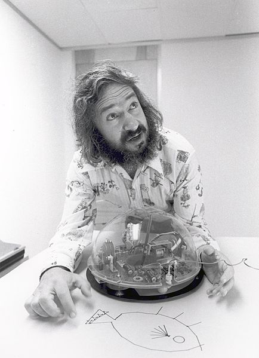

A bit of history
****************

Now you've taken your first steps with turtle graphics, it's time to answer a
few questions, like:

* Who invented turtle graphics?
* Why is it called a turtle?
* What's the advantage of turtle graphics?
* Really though, why a turtle 🐢 and not a horse 🐎 or a badger 🦡?

Who invented turtle graphics?
=============================

Educator and computer scientist Seymour Papert and his colleagues created a
programming language called Logo in 1967, with a specific focus on education.
Later this language was used to direct a hemispheric robot which crawled over
a large sheet
of paper. In the middle of the robot was a pen that could be lowered to draw
lines on the paper:

Why is it called a turtle?
==========================

Because of the round shape of the robot and the way it crawled across the page
it was called a turtle! (Turtle robots weren't invented by Papert; they had
been in use since the 1940s).

What's the advantage of turtle graphics?
========================================

Turtle graphics is a way of the learner (that's you!) getting active, visual
feedback as you learn to program, and is much more engaging than the
traditional approach of working with text and numbers.

One important part of the practice of programming is your
mental model of what the computer is doing as the program is running. The
turtle helps to make this explicit as you learn.

Extra question: Why Python and not Logo?
========================================

Python and Logo share a very similar philosophy. They were both designed
to provide a gentle learning curve for beginners, and to have code that's
very clear to read. They were also both designed to be powerful for expert
users.

These days Logo has fallen out of use except for in education, whereas
Python has a wide variety of uses: for example in data analysis, AI and
web server code.

Credits
=======

Picture of Papert plus Turtle via Wikimedia: Matematica C3 Algebra DOLCE 1,
Testo per il primo biennio della Scuola Secondaria di II grado, prima
edizione anno 2014. Pagg. 344.
licenza Creative Commons BY:
`http://www.matematicamente.it/staticfiles/manuali-cc/algebra1_dolce_1ed.pdf <http://www.matematicamente.it/staticfiles/manuali-cc/algebra1_dolce_1ed.pdf>`_